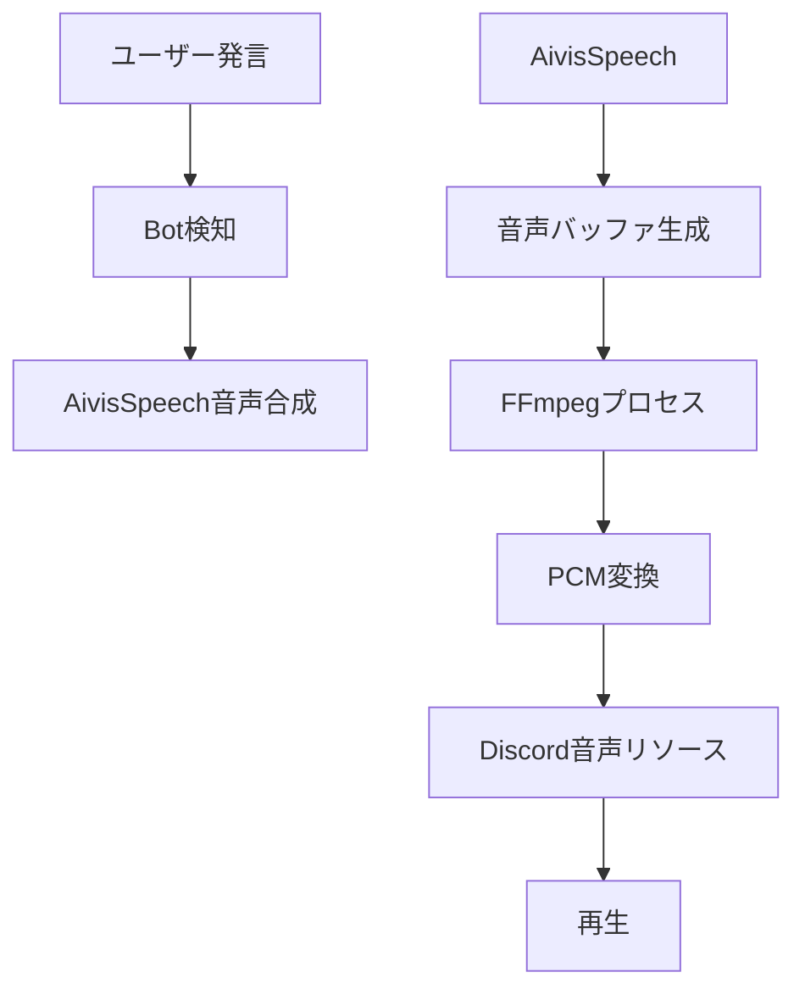
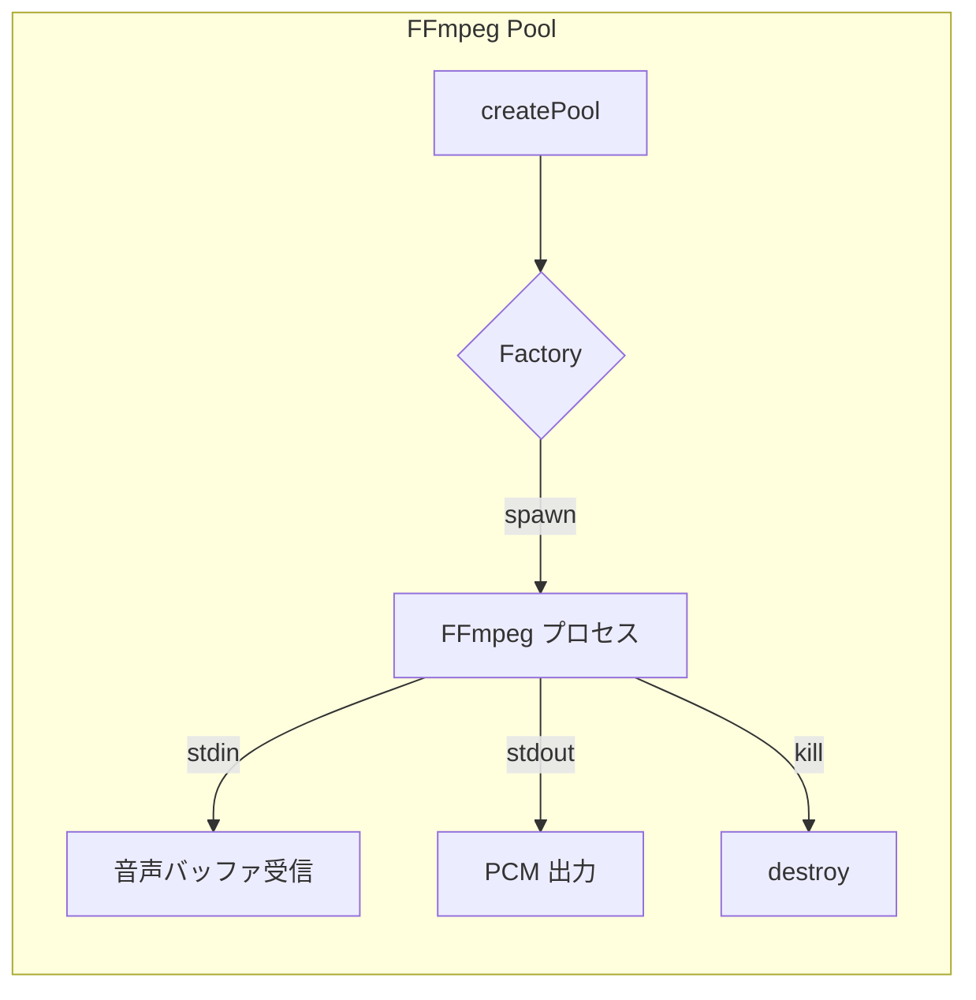
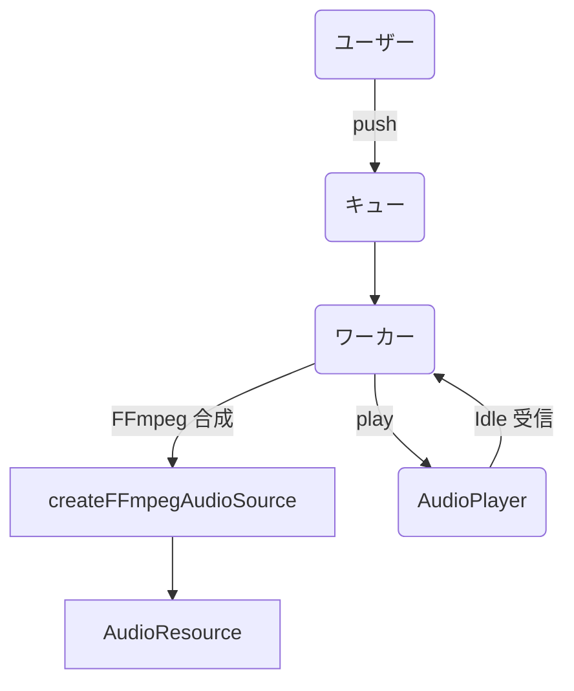

---

## title: AivisSpeechとFFmpegプロセスプールによるリアルタイム高性能TTS Botの実現

## はじめに

こんにちは！このページでは、私が開発している自作TTS Discord Botの技術的な工夫や仕組みを紹介します。最近では、VOICEVOXを使った読み上げBotがよく見られますが、それを遥かに超える性能と柔軟性を目指して設計しました。

## 特徴

- 高速なリアルタイム読み上げ
- 低レイテンシな音声合成（AivisSpeech）
- FFmpegプロセスプールによる高速な音声変換
- 複数ワーカーによる並列再生処理
- Patreon連携による動的な機能制御

## 技術スタック

- Node.js (Discord.js, @discordjs/voice)
- FFmpeg（音声ストリーム処理）
- generic-pool（プロセスプール管理）
- 自作音声エンジン「AivisSpeech」
- Firebase + Patreon API連携（サブスク管理）

## 音声生成の流れ



## プロセスプールの実装



FFmpegプロセスは起動にコストがかかるため、以下のようにプール化して再利用しています：

```ts
const ffmpegFactory = {
  create: async (): Promise<ChildProcess> => {
    return spawn('ffmpeg', [
      '-i','pipe:0','-f','s16le','-ar','48000','-ac','2','-acodec','pcm_s16le','pipe:1'
    ]);
  },
  destroy: async (cp: ChildProcess) => {
    cp.kill();
  },
  validate: async (cp: ChildProcess) => !!(cp.stdin && cp.stdin.writable && cp.stdout && cp.stdout.readable)
};

const ffmpegPool = genericPool.createPool(ffmpegFactory, {
  min: 1,
  max: 4,
  idleTimeoutMillis: 30000
});
```

## ワーカー + キューアーキテクチャ



同時に複数の再生要求が来ても対応できるよう、各ギルドごとにキューとワーカーを保持しています。

```ts
// キューに追加
queue.push({ buffer, metadata });

// ワーカーで処理
async function processQueue() {
  while (queue.length > 0) {
    const item = queue.shift();
    const { resource } = await createFFmpegAudioSource(item.buffer);
    player.play(resource);
    await entersState(player, AudioPlayerStatus.Idle, timeout);
  }
}
```

## サブスク連携による動的な制限

Patreonサポーターかどうかで、同時再生可能数や優先順位を調整可能にしています：

```ts
const isPremium = await isUserPremium(guildId);
const maxConcurrency = isPremium ? 4 : 1;
```

## 結果と今後

この構成により、**高速で安定したTTS再生**が実現できました。今後は以下のアップデートを検討中です：

- 日本語以外の言語への対応
- GPU利用による音声合成高速化
- Web UIやBot利用統計の可視化

## おわりに

ここまで読んでくださってありがとうございました！\
もし興味を持ったら、GitHubでAivis Chan Botをチェックしたり、Discordでフィードバックをくれるとうれしいです！

---

[GitHub リポジトリを見る](https://github.com/Paradise-Lost-Developer-Team/Aivis-chan-bot)